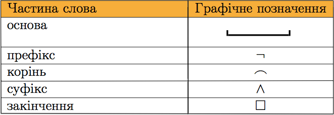

# Будова слова

Означення

<b>Морфеміка</b> — роздiл науки про мову, що вивчає значущi частинислова, або морфеми.

В українськiй мовi бiльшiсть слiв складаються з двох i бiльше морфем. Кожна з них має своє значення.

Означення

<b>Морфема</b> — найменша неподiльна значуща частина слова. Вона виражає граматичне або лексичне значення.

Наприклад, у словi осiннiй видiляють три морфеми: корiнь,суфiкс i закiнчення.

Кожна морфема позначається умовною позначкою:

