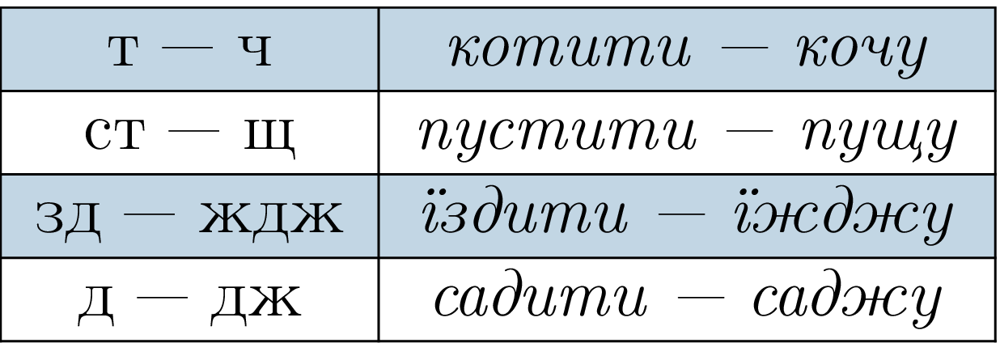

# Чергування приголосних звуків

Чергування [г] – [ж], [к] – [ч], [х] - [ш]. Вiдбуваються при словотвореннi i словозмiнi: *увага - уважний - зауваження, галка - галчин - галченя - Галченко, смiх - смiшний – усмiшка*.

https://www.youtube.com/watch?v=4pyiOJhQJrY|

  

  

|<a href="https://study.ed-era.com/courses/EdEra/U101/u101/about"><button class="but">Переглянути курс!</button></a>

Чергування [г] – [з′], [к] – [ц′], [х] – [с′]. Вiдбуваються при словозмiнi перед закiнченням -i: *луг - у лузi, райдуга - райдузi, гiлка - на гiлцi, донька - доньцi, свекруха - свекрусi, капелюх - у капелюсi*.

У дiєсловах вiдбувається перехiд приголосних [д], [т], [з], [с] у шиплячi, а саме:

В iнших частинах мови чергується [д] — [ж]: *уродити — урожай, огородити — огорожа, погода — погожий, переходити — перехожий, правда — справжнiй*.

У буквосполученнях дт, тт першi звуки [д] i [т] чергуються з приголосним [с]: *веду — вести, ненавидiти — ненависть, цвiт — цвiсти, мету — мести*.

<quiz correctLabel="correct" incorrectLabel="incorrect" checkLabel="check">
    <question text="">
        
Приголосні чергуються у слові:

        <answer correct>горох</answer>
        <answer>диван</answer>
        <answer>Літо</answer>
        <answer>щастя</answer>
        <explanation>
        горох – горошок
        </explanation>
    </question>
    
</quiz>
