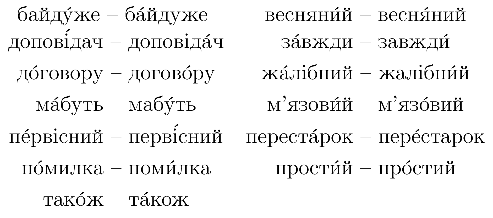
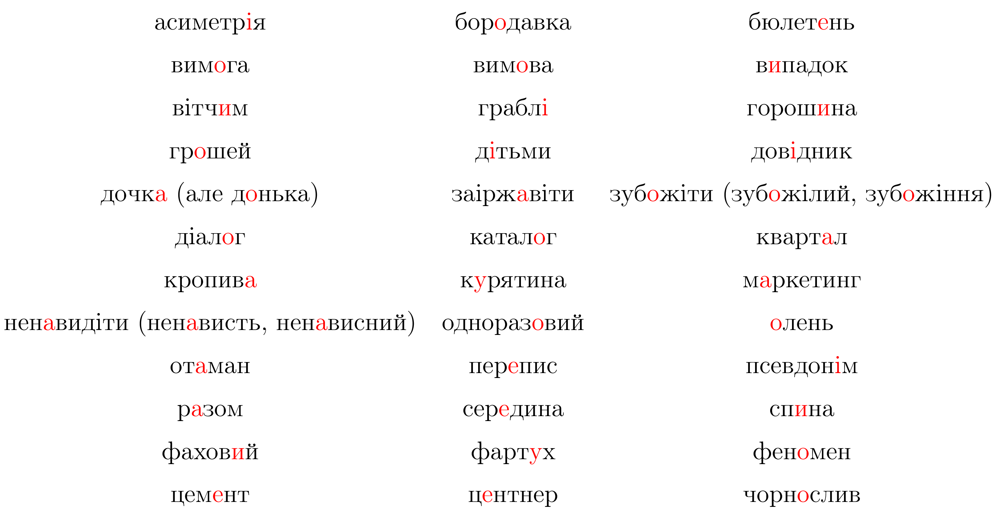

# Наголос

Означення

<b>Наголос</b> — це видiлення голосом певного складу в словi.

Наголос в українськiй мовi є вiльним. Тобто, у рiзних словах вiн може припадати на рiзнi склади.

Наприклад: *$$\acute{а}збука, аб\acute{е}тка, алфав\acute{і}т$$*.

Також наголос є рухомим. Тобто вiн може зi змiною слова перемiщуватися: *$$к\acute{и}жка - книжк\acute{и}$$*.

<b>Деякi слова в українськiй мовi мають подвiйний наголос:</b>

<b>Проблемнi випадки наголошування:</b>

