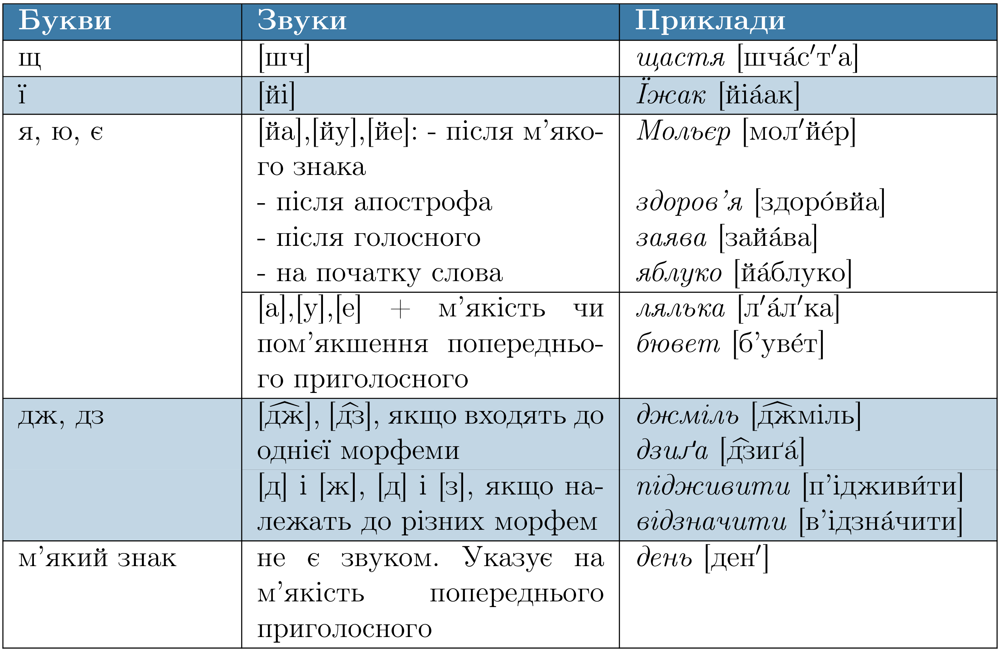

# Співвідношення звуків і літер

В українськiй мовi для позначення бiльшостi звукiв iснують окремi букви. Наприклад, приголосний [д] на письмi передає лiтера д, а голосний [у] на письмi позначається лiтерою y. Проте є винятки.

<table>
  <body>
    <tr>
      <td align="center" valign="top">
        <b>Букви</b>
      </td>
      <td align="center" valign="top" >
        <b>Звуки</b>
      </td>
      <td align="center" valign="top" >
        <b>Приклади</b>
      </td>
    </tr>

    <tr>
    <td valign="top">
        щ
      </td>
      <td valign="top" >
        [шч]
      </td>
      <td valign="top" >
        $$щастя$$ [$$шч\acute{а}с$$′$$т$$′$$а$$]
      </td>
    </tr>

    <tr>
    <td valign="top">
        щ
      </td>
      <td valign="top" >
        [шч]
      </td>
      <td valign="top" >
        $$щастя$$ [$$шч\acute{а}$$с$$′$$т$$′$$а$$]
      </td>
    </tr>

    <tr>
    <td valign="top">
        щ
      </td>
      <td valign="top" >
        [шч]
      </td>
      <td valign="top" >
        $$щастя$$ [$$шч\acute{а}$$с$$′$$т$$′$$а$$]
      </td>
    </tr>

    <tr>
    <td valign="top">
        щ
      </td>
      <td valign="top" >
        [шч]
      </td>
      <td valign="top" >
        $$щастя$$ [$$шч\acute{а}$$с$$′$$т$$′$$а$$]
      </td>      
    </tr>

    <tr>
    <td valign="top">
        щ
      </td>
      <td valign="top" >
        [шч]
      </td>
      <td valign="top" >
        $$щастя$$ [$$шч\acute{а}$$с$$′$$т$$′$$а$$]
      </td>
    </tr>

    <tr>
    <td valign="top">
        щ
      </td>
      <td valign="top" >
        [шч]
      </td>
      <td valign="top" >
        $$щастя$$ [$$шч\acute{а}$$с$$′$$т$$′$$а$$]
      </td>
    </tr>
  </body>
</table>

<quiz correctLabel="correct" incorrectLabel="incorrect" checkLabel="check">
    <question text="">
        
Однакова кількість звуків і букв у кожному слові рядка:

        <answer>барвінок, молодь, апельсин</answer>
        <answer>портьєра, дзеркало, щедро</answer>
        <answer>фаянс, лимон, надріз</answer>
        <answer correct>мереживо, якийсь, рельєф </answer>
        <explanation>
        [ме\(^и\)ре́жи\(^е\)о], [йаки́йс′], [рел′йе́ф]
        </explanation>
    </question>
</quiz>
