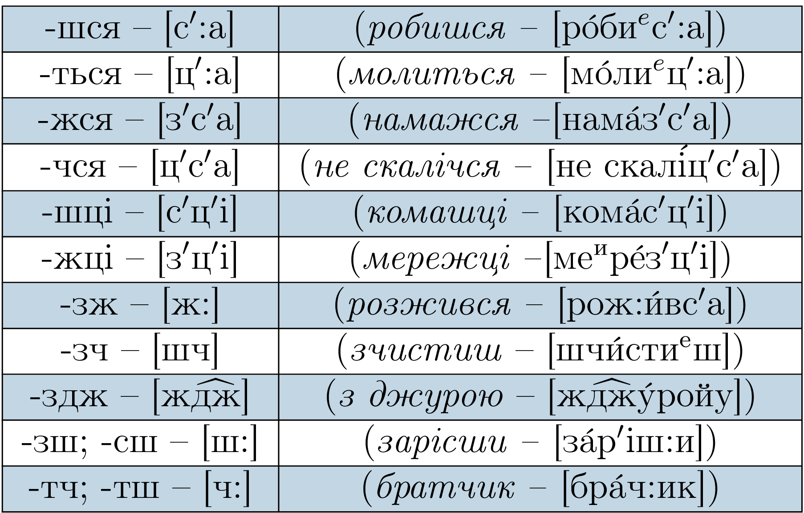

# Уподібнення приголосних звуків

* Уподiбнення за глухiстю
 * Дзвiнкi не оглушуються. 
  Винятки: *легко* [$$л\acute{е}хко$$], *вогко*, *кiгтi*, *нiгтi*, *дьогтю*
 * Приголосний з у префiксах з-, роз-, без-, через- перед глухими переходить в с. Наприклад: *безперечно* [$$бе^испе^ир\acute{е}чно$$].

ЗНО 

В тестовому завданнi часто зустрiчається щось подiбне: <i>лiжко</i> [$$л^{'}\acute{і}шко$$]. Це неправильно, адже [к] – глухий, а [ж] – дзвiнкий. Перед глухими дзвiнкi не змiнюються.

 

* Уподiбнення за дзвiнкiстю 
 Глухi приголоснi перед дзвiнкими одзвiнчуються: *боротьба* – [$$бород′б\acute{а}$$]
* Уподiбнення за м’якiстю 
Попереднiй приголосний стає м’яким пiд впливом наступного. Наприклад: *кузня* [$$к\acute{у}з′н′а$$]. Це стосується лише приголосних [д], [т], [з], [с], [ц], [л], [н], [дз], [р]
* Уподiбнення за мiсцем i способом творення 
При цiй асимiляцiї зливається або дуже наближається вимова близьких звукiв. 
Свистячi уподiбнюються наступним шиплячими. 
Наприклад: *безжурний* - $$бе[ж:]\acute{у}рний$$, *принісши* - $$прин\acute{і}[ш:]и$$.

Деякi особливостi вимови груп приголосних краще запам’ятати:

