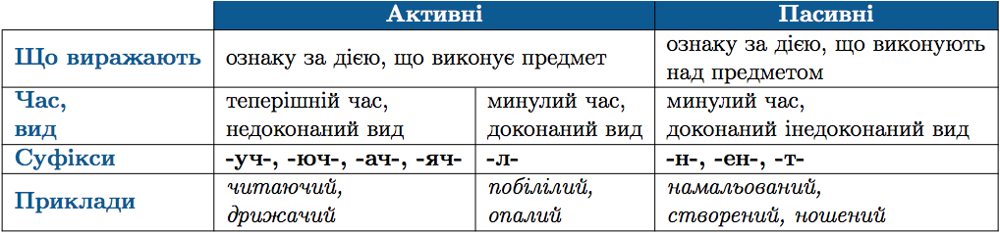

#Активнi та пасивнi дiєприкметники

 

<table style="width: 100%;" align="center">
    <body>
        <tr>  
            <td width="20%" align="center"  valign="top">
                
            </td>
            <td  colspan="2" align="center" valign="top">
                <b>Активнi</b>
            </td> 
            <td width="30%" align="center" valign="top">
                <b>Пасивнi</b>
            </td>                   
        </tr>

        <tr>  
            <td width="20%"  valign="top">
                <b>Що виражають</b>
            </td>
            <td  colspan="2"  valign="top">
                ознаку за дiєю, що виконує предмет
            </td> 
            <td width="30%"  valign="top">
                ознаку за дiєю, що виконують над предметом
            </td>                   
        </tr>

        <tr>  
            <td width="20%"  valign="top">
                <b>Час, вид</b>
            </td>
            <td width="25%" valign="top">
                теперiшнiй час, недоконаний вид
            </td> 
            <td width="25%" valign="top">
                минулий час, доконаний вид
            </td> 
            <td width="30%"  valign="top">
                минулий час, доконаний i недоконаний вид
            </td>                   
        </tr>

        <tr>  
            <td width="20%"  valign="top">
                <b>Суфiкси</b>
            </td>
            <td width="25%" valign="top">
                -уч-, -юч-, -ач-, -яч-
            </td> 
            <td width="25%" valign="top">
                -л-
            </td> 
            <td  width="30%" valign="top">
                -н-, -ен-, -т-
            </td>                   
        </tr>

        <tr>  
            <td width="20%"  valign="top">
                <b>Приклади</b>
            </td>
            <td width="25%" valign="top">
                <i>читаючий, дрижачий</i>
            </td> 
            <td width="25%" valign="top">
                <i>побiлiлий, опалий</i>
            </td> 
            <td  width="30%" valign="top">
                <i>намальований, створений, ношений</i>
            </td>                   
        </tr>
    </body>
</table>

ЗНО

Не треба зловживати активними дiєприкметниками теперiшнього часу (<i>пишучий, працюючий</i>). Краще використовувати замiсть них вiдповiднi прикметники, iменники, пасивнi дiєприкметники чи навiть дiєприслiвниковi звороти i пiдряднi речення. 
Наприклад:
<i>Усi працюючi мають пiльги. – Усi працiвники мають пiльги.</i> 
Можна використовувати конструкцiї той, що; той, який; тi, що; тi, якi.  
Наприклад:
<i>Вiдпочиваючi санаторiю – тi, якi вiдпочивають у санаторiї.</i>

 

<quiz> 
    <question>
       
Активний дієприкметник наведено у рядку:

           <answer>обраний</answer>
           <answer>написаний</answer>
           <answer correct>правлячий</answer>
           <answer>тертий</answer>
      <explanation>
Правлячий – активний. 
Обраний, написаний, тертий – пасивні.
</explanation>
    </question>
</quiz> 
