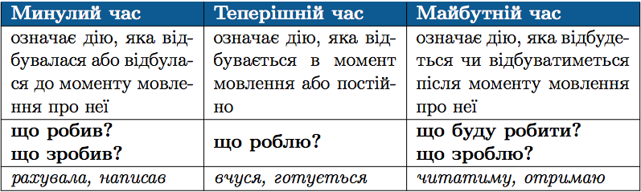
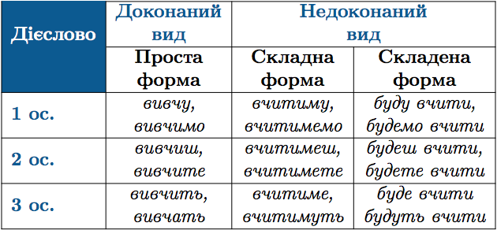

#Часи дiєслова

Час дiєслова визначається за моментом повiдомлення про дiю.

 

Вiд дiєслiв недоконаного виду у майбутньому часi утворюються двi
форми: <b>складна</b> та <b>складена</b>. А вiд дiєслiв доконаного виду – тiльки <b>проста</b>.

 