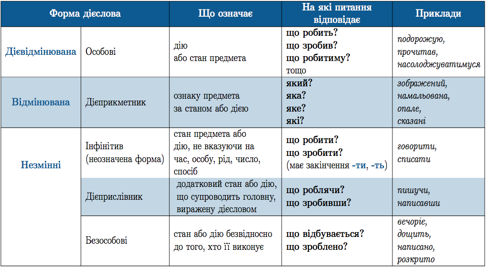

#Дiєслово

Означення

<strong>Дiєслово</strong> — самостiйна частина мови, що називає стан предмета або дiю i вiдповiдає на запитання що робить (робив, зробив, буде робити, зробив би) предмет? що з ним робиться (робитиметься, робилося, зробиться, зробилося б?) тощо.

Наприклад: <i>писати, намалював, гратиме, вивчив би.</i> 
Морфологiчнi ознаки дiєслова: вид, час, спосiб, особа та число або
рiд. 
У реченнi переважно виконує функцiю присудка.

Форма дієслова

 

<quiz> 
    <question>
       
Дієсловами є всі слова рядка

           <answer>писати, заощадити, переказ</answer>
           <answer>внесок, створювати, прочитати</answer>
           <answer>гарний, зараховувати, зберегти</answer>
           <answer correct>носити, іскритися, хмаритись</answer>
      <explanation>
Носити, іскритися, хмаритись – дієслова. 
Переказ, внесок – іменники. 
Гарний – прикметник. 
</explanation>
    </question>
</quiz> 
