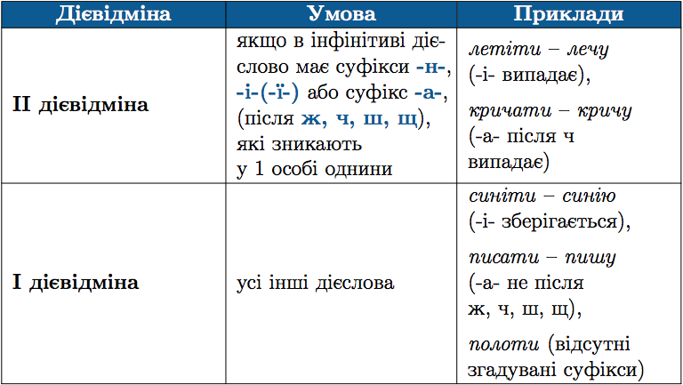
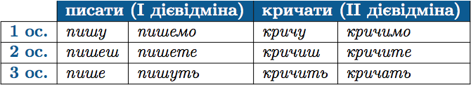
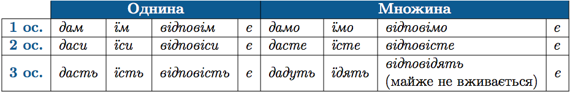
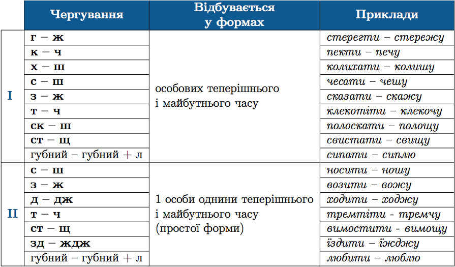

#Дiєвiдмiни дiєслiв

Визначення дiєвiдмiни дiєслiв дозволяє встановити їхнi правильнi особовi закiнчення. Iснує два способи такого визначення:

<b>&rarr;</b> За закiнченням 3 особи множини.

 

<b>&rarr;</b> За основою iнфiнiтива (тобто частиною дiєслова без -ти)

 

До <b>II дiєвiдмiни</b> також належать:
<ul>
<li>Усi дiєслова на хотiти: <i>булькотiти, бурмотiти, муркотiти, цокотiти</i>.</li>
<li> <i>Боятися, стояти</i> (з основою на -я).</li>
<li> <i>Cпати</i> (з основою на -а не пiсля шиплячого).</li>
<li> <i>Бiгти</i> (з основою на приголосний).</li>
</ul>

До I дiєвiдмiни також належать дiєслова <i>хотiти, жати, iржати, ревiти, слати</i>.

Особовi закiнчення дiєслiв I i II дiєвiдмiн

 

##Дiєвiдмiнювання дiєслiв дати, їсти, бути та з -повiсти

Дiєслова дати, їсти, бути, . . . повiсти (розповiсти, доповiсти тощо) утворюють окрему групу. Вони <b>НЕ</b> належать до дiєвiдмiн, як i
похiднi вiд них.

 

Але видовi пари цих дiєслiв вiдмiнюються за сучасним зразком.  Наприклад: <i>доїдати – доїдаю, доїдаєш, доїдає, доїдаємо, доїдаєте, доїдають</i> тощо.

##Чергування приголосних за дiєвiдмiнювання

 

<quiz> 
    <question>
       
Дієслово першої дієвідміни наведено в рядку:/p>
           <answer>сидіти</answer>
           <answer correct>жити</answer>
           <answer>любити</answer>
           <answer>бути</answer>
      <explanation>
Жити – живуть, сидіти – сидять, любити – люблять. 
Закінчення -уть, -ють у третій особі множини – I дієвідміна. 
Бути - не належить до дієвідмін (є).
</explanation>
    </question>
</quiz> 

<quiz> 
    <question>
       
Дієслово другої дієвідміни наведено в рядку:

           <answer>червоніти</answer>
           <answer>дати</answer>
           <answer>дихати</answer>
           <answer correct>стояти</answer>
      <explanation>
Стояти – стоять, червоніти – червоніють, дихати – дихають. 
Закінчення -ать, -ять у третій особі множини – II дієвідміна. 
Дати - не надлежить до дієвідмін (дадуть). 
</explanation>
    </question>
</quiz> 
