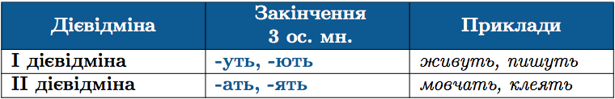

#Дiєвiдмiни дiєслiв

Визначення дiєвiдмiни дiєслiв дозволяє встановити їхнi правильнi особовi закiнчення. Iснує два способи такого визначення:

<b>&rarr;</b> За закiнченням 3 особи множини.

 

<b>&rarr;</b> За основою iнфiнiтива (тобто частиною дiєслова без -ти)

 
 

До <b>II дiєвiдмiни</b> також належать:
<ul>
<li>Усi дiєслова на хотiти: <i>булькотiти, бурмотiти, муркотiти, цокотiти</i>.</li>
<li> <i>Боятися, стояти</i> (з основою на -я).</li>
<li> <i>Cпати</i> (з основою на -а не пiсля шиплячого).</li>
<li> <i>Бiгти</i> (з основою на приголосний).</li>
</ul>