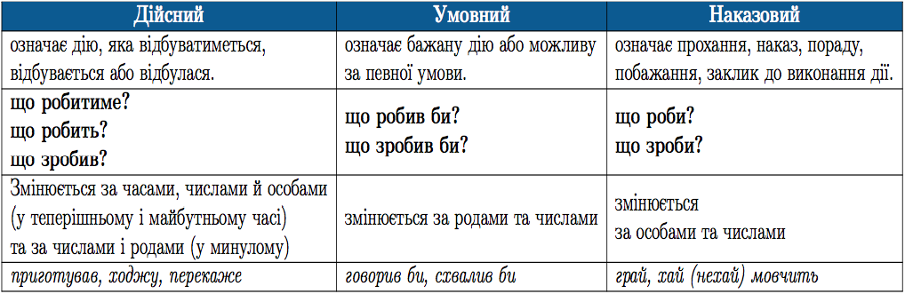
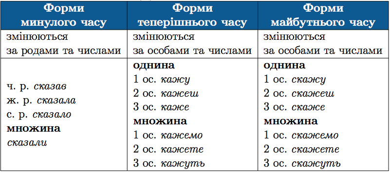
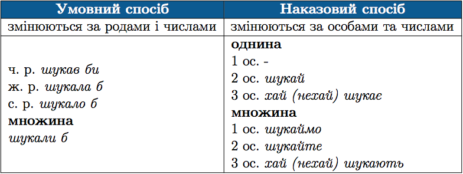
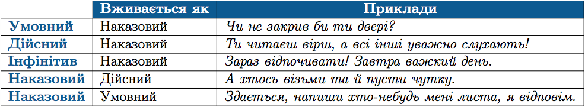

#Способи дiєслiв

Спосiб дiєслова виражає вiдношення дiї до реальностi. Iснує три способи дiєслiв: <i>дiйсний, умовний та наказовий</i>.

 

Дiйсний спосiб

 

 

ЗНО

Форму наказового способу дiєслова не варто утворювати за допомогою
часток <b>давай, давайте</b>, бо це не вiдповiдає лiтературнiй нормi.

 

Вживання форми одного способу дiєслова у значеннi iншого

 

<quiz> 
    <question>
       
Усі дієслова одного способу подано в рядку

           <answer>пишемо, повідомили, передай</answer>
           <answer correct>перевірте, збережи, працюймо</answer>
           <answer>несла б, писали б, доглядайте</answer>
           <answer>мріють, попросили, чистили б</answer>
      <explanation>
Перевірте, збережи, працюймо – дієслова наказового способу. 
Пишемо, повідомили, мріють, попросили – дієслова дійсного способу. 
Несла б, писали б, чистили б – дієслова умовного способу.</explanation>
    </question>
</quiz> 
