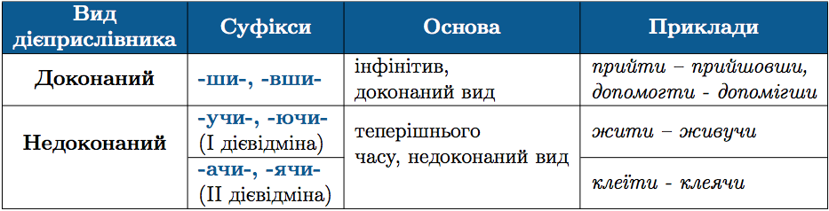

#Творення дiєприслiвникiв

 

<quiz> 
    <question>
       
Дієприслівник доконаного виду наведено в рядку

           <answer>поспішаючи</answer>
           <answer>хвилюючись</answer>
           <answer correct>замислившись</answer>
           <answer>блукаючи</answer>
      <explanation>
Замислившись – доконаний вид.
Поспішаючи, хвилюючись, блукаючи – недоконаний вид
</explanation>
    </question>
</quiz> 
