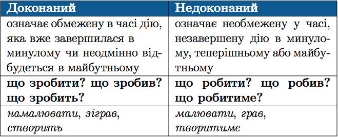

#Види дiєслова

Дiєслова можуть називати дiю, обмежену в часi початком чи кiнцем,
або дiю, не обмежену нi кiнцем, нi початком. За цiєю ознакою вони
подiляються на два види: доконаний та недоконаний.

 