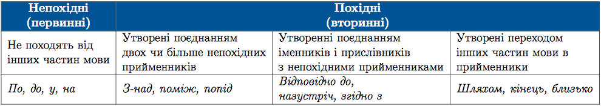

#Групи прийменникiв за походженням

За походженням прийменники розрiзняють <b>непохiднi</b> (первиннi) i <b>похiднi</b> (вториннi).

Первиннi з’явилися у мовi давно, вони не походять вiд iнших слiв. А вториннi утворилися вiд рiзних частин мови: iменникiв, прислiвникiв, дiєслiв.

 