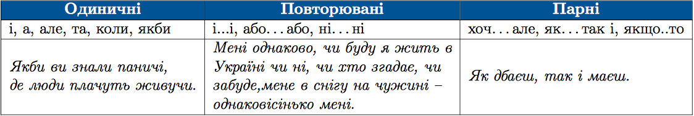
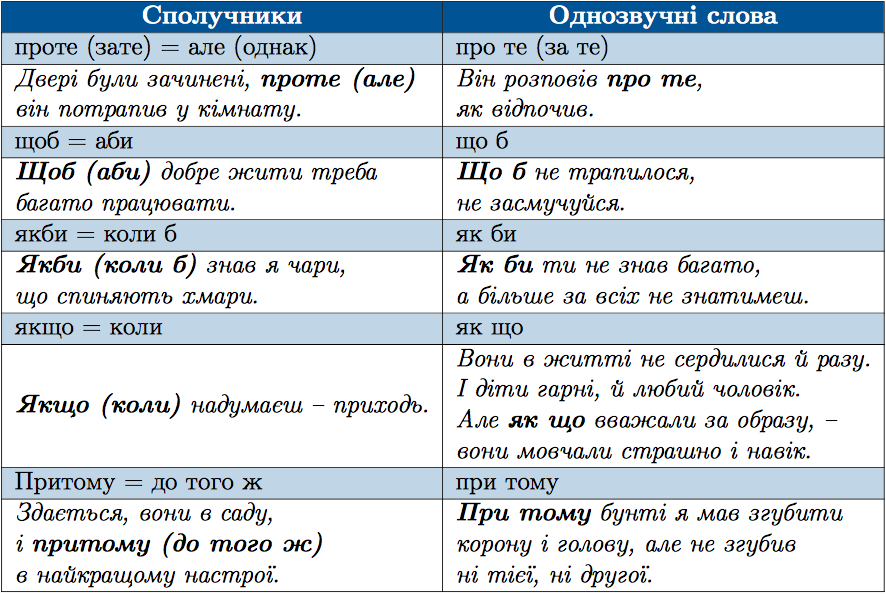

#Групи сполучникiв за вживанням

 

Важливо розрiзняти сполучники i однозвучнi з ними повнозначнi слова з частками або прийменниками, якi пишуться окремо. Наприклад: <i>проте – про те, зате – за те, якби – як би, якщо – як що, щоб – що б</i>.
 

На однозвучне повнозначне слово зазвичай падає наголос, а сполучники можна замiнити iншими синонiмiчними сполучниками.

 