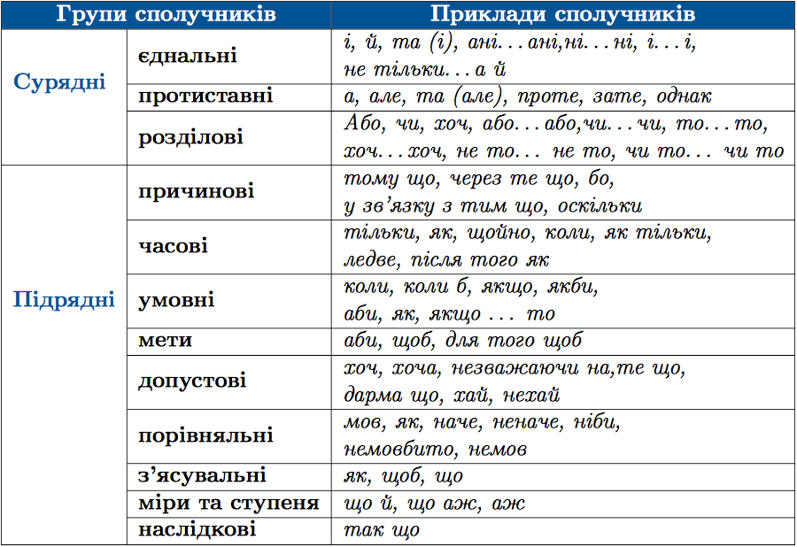

#Групи сполучникiв за значенням

За значенням сполучники подiляються на <b>суряднi</b> та <b>пiдряднi</b>.
 

Суряднi з’єднують однорiднi члени або рiвноправнi речення:<i> весело та цiкаво; Пiдiйде сонце високо, а Тарас ще спить</i>.
Пiдряднi сполучники приєднуть пiдряднi речення до головного: <i>Через дверi було видно маленьку кiмнату, де жила проскурниця.</i>

 