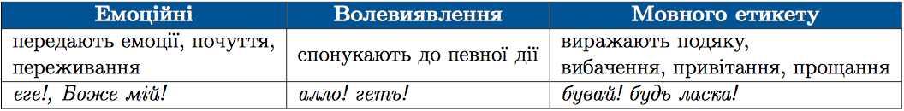

#Групи вигукiв за значенням

 

<quiz> 
    <question>
       
Вигук виділено в реченні:

           <answer><b>Візьми</b> ж та поприбирай.</answer>
           <answer correct><b>Геть</b>, одчепися од мене!</answer>
           <answer><b>Нехай</b> його чорти розкопують.</answer>
           <answer>Нащо це ти, <b>Мотре</b>, так прибираєшся?</answer>
    </question>
</quiz> 
