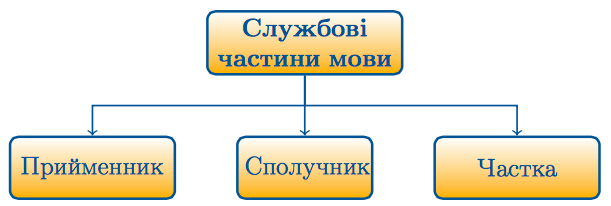

#Службовi частини мови

Визначення

<strong>Службовi частини мови</strong> — неповнозначнi слова, якi не називають предметiв чи будь-яких реалiй, а вказують на вiдношення мiж ними.

 

<h4>Зміст підрозділу:</h4>

   1. [Прийменник](11/priymennik.md)
        1. [Групи прийменникiв за будовою](11/grupi_priymennikiv_za_budovoyu.md)
        2. [Групи прийменникiв за походженням](11/grupi_priymennikiv_za_pohodjennyam.md)
        3. [Зв’язок прийменника з непрямими вiдмiнками](11/znyazok_priymennika_z_nepryamimi_vidminkami_imennika.md)
   2. [Сполучник](11/spoluchnik.md)
        1. [Групи сполучникiв за будовою](11/grupi_spoluchnikiv_za_budovoyu.md)
        2. [Групи сполучникiв за вживанням](11/grupi_spoluchnikiv_za_vjivannyam.md)
        3. [Групи сполучникiв за значенням](11/grupi_spoluchnikiv_za_znachennyam.md)
   3. [Частка](11/chastka.md)
        1. [Групи часток за значенням i вживанням](11/grupi_chastok_za_znachennyam_i_vjivannyam.md)
        2. [Правопис часток](11/pravopis_chastok.md)
   4. [Вигук](11/viguk.md)
        1. [Групи вигукiв за походженням](11/grupi_vigukiv_za_pohodjennyam.md)
        2. [Групи вигукiв за значенням](11/grupi_vigukiv_za_znachennyam.md)
        3. [Звуконаслiдувальнi слова](11/zvukonasliduvalni_slova.md)