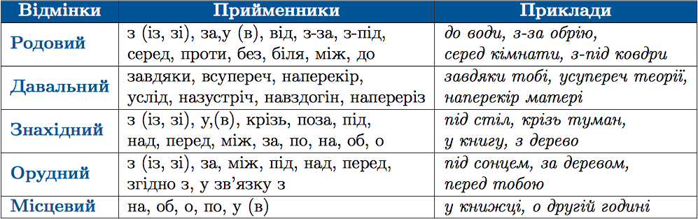

#Зв’язок прийменника з непрямими вiдмiнками iменника

Прийменники вживаються з iменниками в усiх непрямих вiдмiнках (крiм кличного). Форма мiсцевого вiдмiнка виступає з прийменником завжди. Іншi вiдмiнковi форми можуть бути з прийменниками чи без них.

 