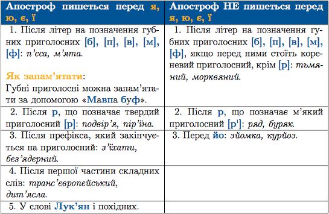

#Апостроф

Означення

<strong>Апостроф</strong> – знак, який передає на письмi роздiльну вимову я, ю, є, ї пiсля твердих приголосних.

 

<quiz> 
    <question>
       
Апостроф треба писати в усіх словах рядка:

           <answer>пів..яйця, п..ятдесят, кр..якати</answer>
           <answer> міжгір..я, пере..їхати, бур..ян</answer>
           <answer correct> з..їсти, об..єднання, дит..ясла</answer>
           <answer> запам..ятати, бар..єр, мавп..ячий</answer>
      <explanation>

З’їсти, об’єднати, дит’ясла.

Крякати, переїхати, мавпячий – без апострофа.
 
</explanation>
    </question>
</quiz> 
