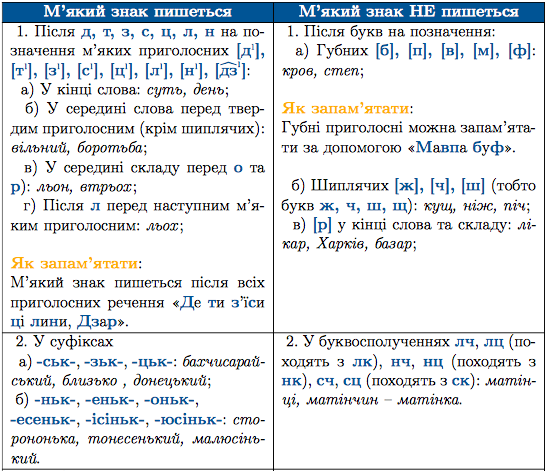

#М'який знак

В українськiй мовi буква Ь (м’який знак) позначає м’якiсть приголосних звукiв.

 

<quiz> 
    <question>
       
М’який знак на місці пропуску треба писати в усіх словах рядка:

           <answer> мален..кий, с..омга, піс..ня</answer>
           <answer correct> годит..ся, праз..кий, лял..чин </answer>
           <answer> сторонон..ка, сяд..те, шіст..десят</answer>
           <answer> війс..ковий, вишен..ці, рибал..ці</answer>
      <explanation>

Годиться, празький, ляльчин.

      
Пісня – між двома м’якими приголосними м’який знак не пишеться;

      
 Шістдесят – у кінці першої частини складених прислівників м’який знак не пишеться; 

      
Рибалці – у буквосполученні <b>лц</b> (від <b>лк</b>) м’який знак не пишеться (рибалка).

</explanation>
    </question>
</quiz> 
