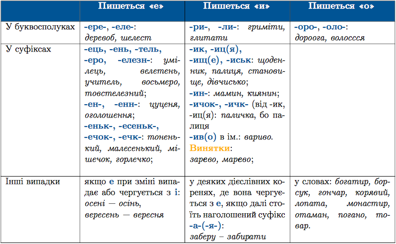

#Правопис лiтер, що позначають ненаголошенi голоснi [е], [и], [о]

Звуки [е], [и] та [о] в українськiй мовi звучать невиразно у ненаголошенiй позицiї, як ми пам’ятаємо ще з фонетики. Тому часом складно визначити, яку лiтеру потрiбно писати.

Написання слiв з цими ненаголошеними звуками перевiряється наголосом. Для визначення голосного треба:

<ol>
<li>Дiбрати спiльнокореневе слово або змiнити форму слова так, щоб сумнiвний звук став наголошеним. Наприклад: <i>зазирну ́ти – зи ́ркати.</i></li>
<li> Якщо за допомогою наголосу перевiрити написання слова не можна, то треба скористатися правилами. 

 
Звернiть увагу, що лiтеру у завжди пишемо в словах: <i>будяк, ворушити, мармур, парубок, пурхати, яблуко, яблуня</i></li>
<li>Якщо написання лiтер перевiрити не можна жодним способом, то треба заглянути в орфографiчний словник. Наприклад: <i>директор, левада, кишеня.</i></li>
</ol>

<quiz> 
    <question>
       
Літеру <b>е</b> треба писати в усіх словах рядка:

           <answer>пер..йти, гр...чаний, кр..латий, довж..лезний</answer>
           <answer>вел..тень, б..региня, цуц..ня, д..ректор</answer>
           <answer correct>ч..рствий, в..рещати, пер..мога, бер..зень</answer>
           <answer>мер..хтіти, тр..вожний, р..монтний, заб..ру</answer>
      <explanation>
Кр<b>и</b>латий, д<b>и</b>ректор і тр<b>и</b>вожний.
</explanation>
    </question>
</quiz> 

<quiz> 
    <question>
       
Літеру <b>о</b> треба писати в усіх словах рядка:

           <answer> д..рога, г..лова, ябл..ко</answer>
           <answer correct> л..пата, к..лосся, ..таман</answer>
           <answer> з..зуля, ч..рнило, марм..ровий</answer>
           <answer> г..рячий, б..гато, доп..мога</answer>
      <explanation>
Ябл<b>у</b>ко, мар<b>му</b>ровий, г<b>а</b>рячий.
</explanation>
    </question>
</quiz> 
