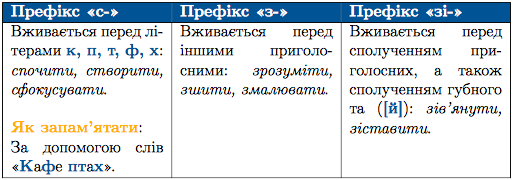

#Правопис префіксів

 

Префiкси вiд-, над-, пiд-, роз-, без-, через-, мiж- тощо не змiнюються. Тобто кiнцевий приголосний цих префiксiв перед глухими приголосними кореня залишається дзвiнким. Наприклад: <i>надписати, обпалити, розставити.</i>
