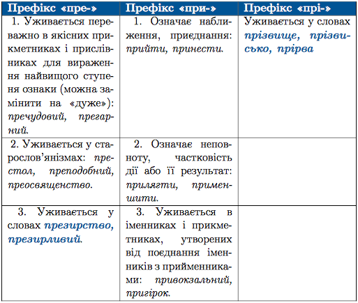

#Правопис префіксів

 

Префiкси вiд-, над-, пiд-, роз-, без-, через-, мiж- тощо не змiнюються. Тобто кiнцевий приголосний цих префiксiв перед глухими приголосними кореня залишається дзвiнким. Наприклад: <i>надписати, обпалити, розставити.</i>

 

<quiz> 
    <question>
       
Літеру <b>з</b> треба писати на місці крапок у всіх словах рядка:

           <answer>..радіти, ро..чистити, бе..крилий </answer>
           <answer>..писати, ..робити, ро..копати</answer>
           <answer correct>ро..житися, ..чорнілий, ..повістити</answer>
           <answer> ..морений, ..підлоба, ..шити</answer>
      <explanation>
p>Зрадіти, розчистити, безкрилий. 

Списати, сповістити, спідлоба – префікс <b>с-</b> уживаємо перед <b>к</b>, <b>п</b>, <b>т</b>, <b>ф</b>, <b>х</b>.
 
</explanation>
    </question>
</quiz> 

<quiz> 
    <question>
       
Літеру <b>и</b> треба писати на місці крапок у всіх словах рядка

           <answer>пр..мерзнути, пр..йти, пр..гарний </answer>
           <answer correct>пр..кидатися, пр..йшов, пр..вітний </answer>
           <answer>пр..гнічений, пр..славний,при..писати</answer>
           <answer> пр..мудрий, пр..бічник, пр..бутки</answer>
      <explanation>

Прикидатися, прийшов, привітний. 

      
Прегарний, преславний, премудрий – найвищий ступінь ознаки.

</explanation>
    </question>
</quiz> 
