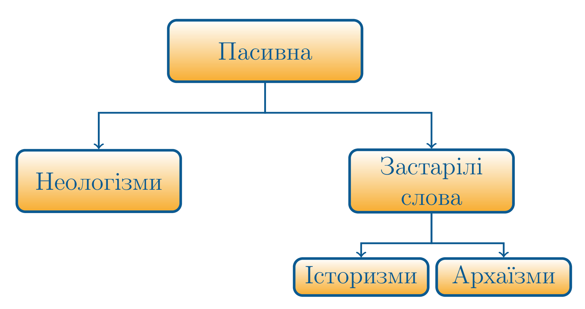

# Активна та пасивна лексика

Словниковий склад мови перебуває в русi. Мова постiйно поповнюється новими словами, а застарiлi зникають. Цi процеси вiдбувають повiльно. Тому в словниковому складi мови iснують два шари лексики: активна i пасивна.

Означення

<b>Активна лексика</b> — це слова, якi регулярно використовуються у повсякденному спiлкуваннi.

Це загальнонароднi слова, якi не мають ознак застарiлостi (*солодкий, свiтло, бiлий, п’ять, писати, завтра*), а також широковiдомi термiни (*iнтеграл, пiдмет, нацiя, принтер*).

Сюди належать <b>застарiлi слова</b> i <b>неологiзми</b>. Застарiлi слова подiляються на <b>iсторизми</b> та <b>архаїзми</b>.

Означення

<b>Пасивна лексика</b> — це слова, якi регулярно використовуються у повсякденному спiлкуваннi.

Означення

<b>Неологiзми</b> — це слова, якi позначають новi поняття i предмети.

Наприклад: <b>маркетинг, менеджер</b>. Неологiзми бувають загальномовними та авторськими. Загальномовнi виникають у мовi для позначення нових понять, а авторськi творять письменники для передачi емоцiй, вражень, почуттiв тощо.

Означення

Авторськi неологiзми часто зустрiчаються у поезiї Павла Тичини. Наприклад, яблуневоцвiтно, злотоцiнно, нiжнотонний тощо. Також вони є у творчостi Лiни Костенко.

Означення

<b>Iсторизми</b> — це слова, що вийшли з ужитку через зникнення реалiй, якi вони називали.

Синонiмiчнi замiнники iсторизмiв у сучаснiй мовi вiдсутнi. Наприклад: <i>жупан, десятина</i>.

Означення

<b>Архаїзми</b> — це слова, витiсненi iншими синонiмами з ужитку.

Наприклад: <i>рамена</i> (плечi), <i>ланiти</i> (щоки), <i>зрiти</i> (бачити).

<quiz correctLabel="correct" incorrectLabel="incorrect" checkLabel="check">
    <question text="">
        
Визначте, до якої групи вживання належать слова:

        <answer>Пахучий, запашний, духмяний, приємний</answer>
        <answer>Стійкий, суворий, міцний, непохитний </answer>
        <answer correct>Урочистий, піднесений, патетичний, пишний </answer>
        <answer>Мовчазний, безмовний, неговіркий, балакучий</answer>
        <answer>Мова, мовний, мовлення, мовити</answer>
        <explanation>
   В першому варіанті зайвим є слово приємний, в другому – суворий, в четвертому – балакучий. В останньому варіанті наведено спільнокореневі слова.
    </explanation>
    </question>
</quiz>