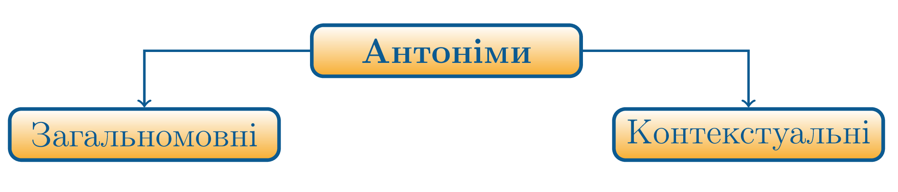
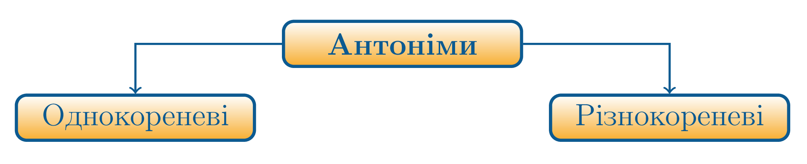

# Антонiми

Визначення

<b>Антонiми</b> — це слова, якi мають протилежне лексичне значення,
однак поєднанi спiльним фактором.

Наприклад: *веселий – сумний* (настрiй), *тепло – холодно* (температура). Антонiми об’єднуються в пари.

Багатозначнi слова можуть мати антонiми для прямих i переносних значень: <i>сухий одяг - мокрий одяг</i>, <i>сухий хлiб - свiжий хлiб</i>.

Антонiми бувають загальномовними та контекстуальними.

Антонiмiчнi стосунки **загальномовних антонiмiв** зрозумiлi поза
будь-яким контекстом. Наприклад: *високий – низький*, *холодний – гарячий*.

**Контекстуальнi антонiми** – це слова, що набувають антонiмiчних стосункiв тiльки в певному контекстi. Наприклад, у реченнi «*Однi податковцi наповнюють державну казну, iншi її розкрадають*» слова «наповнюють» i «розкрадають» будуть контекстуальними антонiмами.

За структурою антонiми дiляться на **однокореневi** i **рiзнокореневi**. Однокореневi утворюються за допомогою додавання префiксiв. Наприклад: *щастя – нещастя, надiя – безнадiя*, *революцiя – контрреволюцiя*. Рiзнокореневi антонiми: *день – нiч*, *початок – кiнець*.

<quiz correctLabel="correct" incorrectLabel="incorrect" checkLabel="check">
    <question text="">
        
В якому рядку подано антонімічні пари:

        <answer>білий – чорний, день – ніч, тихий – темний</answer>
        <answer>говорити – слухати, далекий – близький, життя – смерть</answer>
        <answer correct>слава – ганьба, довгий – короткий, ясно – темно</answer>
        <answer>холодний – крижаний, праця – відпочинок, вгору – вбік</answer>
        <explanation>
  Тихий – темний, говорити – слухати, вгору – вбік не є антонімічними парами.
    </explanation>
    </question>
</quiz>

<quiz correctLabel="correct" incorrectLabel="incorrect" checkLabel="check">
    <question text="">
        
Антоніми виділено в реченні:

        <answer correct><b>Брехня</b> стоїть на одній нозі, а <b>правда</b> на двох.</answer>
        <answer><b>Осінній</b> день, осінній день, осінній! О <b>синій</b> день, о синій день, о синій!</answer>
        <answer><b>Недумано</b>, <b>негадано</b> забігла в глухомань, де сосни пахнуть ладаном в кадильницях світань.</answer>
        <answer>Мов тихий дзвін гірського кришталю, <b>несказане</b> лишилось <b>несказанним</b>.</answer>
        <answer>Минають фронди і жіронди, минає <b>славне</b> і <b>гучне</b>.</answer>
        <explanation>
 Брехня та правда – антоніми.
    </explanation>
    </question>
</quiz>

