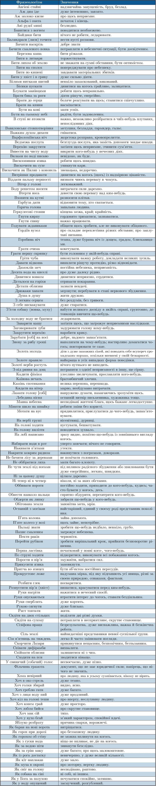

# Словник найуживаніших фразеологізмів
<!---

<table style="width:100%">
  <tr>
    <td>Авгiєвi стайні</td>
    <td>звичайна запущенiсть, бруд, безлад
    
    </td> 
  </tr>
  <tr>
    <td>Аж дим iде</td>
    <td>дуже iнтенсивно, завзято.</td> 
  </tr>
 <tr>
    <td>Аж молоко кисне</td>
    <td>про щось неприємне</td> 
  </tr>
 <tr>
    <td>Альфа i омега</td>
    <td>початок i кiнець.</td> 
  </tr>
</table>
-->

### Авгiєвi стайні
звичайна запущенiсть, бруд, безлад

### Авгiєвi стайні
звичайна запущенiсть, бруд, безлад

## Авгiєвi стайні
звичайна запущенiсть, бруд, безлад

## Авгiєвi стайні
звичайна запущенiсть, бруд, безлад

<quiz correctLabel="correct" incorrectLabel="incorrect" checkLabel="check">
    <question text="">
        
Який синонім фразеологізму “Заливати за шкуру сала”?

        <answer>Ні сіло ні впало</answer>
        <answer>Врізати дуба</answer>
        <answer correct>Допікати до живого</answer>
        <answer>Був на коні і під конем</answer>
    </question>
</quiz>

<quiz correctLabel="correct" incorrectLabel="incorrect" checkLabel="check">
    <question text="">
        
Яке значення має фразеологізм “Бачити смаленого вовка”?

        <answer>Добре знати</answer>
        <answer>Торжествувати</answer>
        <answer>Очуватися спокiйно, затишно</answer>
        <answer correct>Потрапляти в небезпечнi ситуацiї, бути досвiдченим</answer>
        <answer>Дивитися на когось грайливо, залицятися</answer>
    </question>
</quiz>