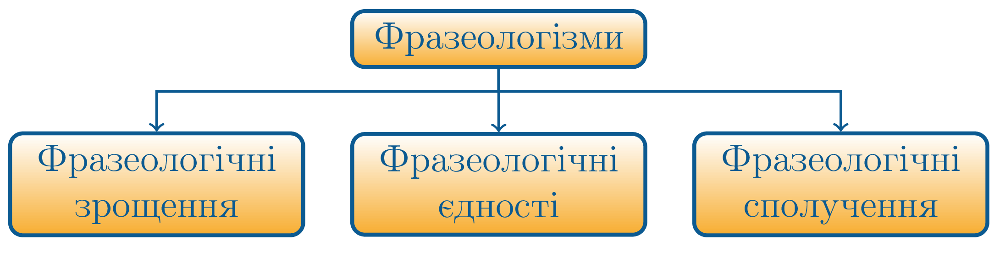

# Види фразеологізмів

* **фразеологiчнi зрощення** – семантично неподiльнi одиницi, значення яких не пов’язанi зi значенням компонентiв. 
Наприклад: <i>як коровi сiдло</i>.

* **фразеологiчнi єдностi** – фразеологiзми, значення компонентiв
яких пов’язанi зi значенням фразеологiзму. 
Наприклад: <i>крапля в морi</i>.
* **фразеологiчнi сполучення** – семантично подiльнi одиницi, компоненти яких мають певну самостiйнiсть. Один з компонентiв є
стiйким i не може замiнюватись, а iншi можуть мати взаємну замiну. 
Наприклад: <i>брати до серця – брати до уваги</i>.

<quiz correctLabel="correct" incorrectLabel="incorrect" checkLabel="check">
    <question text="">
        
Які фразеологізми являються семантично неподільними компонентами,що мають певну самостійність:

        <answer>Фразеологічні зрощення</answer>
        <answer>Фразеологічні єдності</answer>
        <answer correct>Фразеологічні сполучення </answer>
    </question>
</quiz>