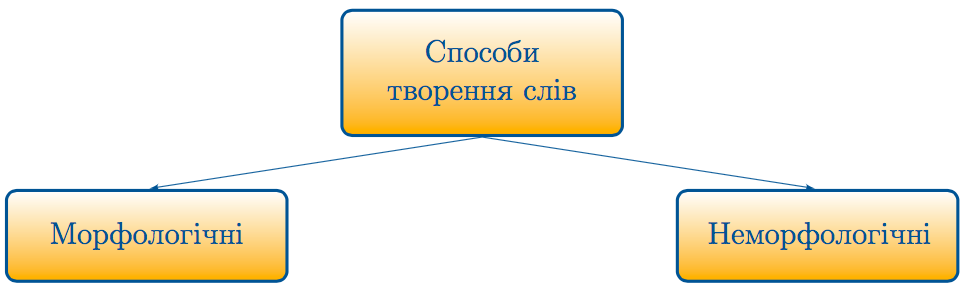

# Словотвір

Означення

<b>Словотвір</b> — роздiл науки про мову, що вивчає особливостi та способи творення похiдних слiв.

Означення

<b>Непохідні слова</b> — це слова, якi не утворенi вiд iнших слiв. Їхня основа складається лише з кореня.

Наприклад: <i>літо, сніг</i>.
 

Означення

<b>Похідні слова</b> — слова, утворенi вiд iнших слiв. Їхнiй спосiб творення можна простежити.

Наприклад: снiжний – снiг + н, пралiс – пра + лiс.

Новi слова утворюються на основi вже iснуючих слiв чи словосполучень, якi називають твiрними.

Означення

<b>Твірне слово</b> — слово, яке "лягає" в основу слова похiдного.

Наприклад: <i>лiс</i> – твiрне, <i>пралiс</i> – похiдне.

Означення

<b>Твірна основа</b> — це частина твiрного слова, яка входить до складу похiдного слова. Вiд неї творяться новi слова.

Наприклад: <i>казка</i> – твiрне слово, <i>казковий</i> – похiдне, <i>казк</i> – твiрна основа. 
Новi слова утворюються переважно за допомогою словотворчих засобiв, якi приєднуються до основи.

Означення

<b>Словотворчі засоби</b> — префiкси, суфiкси, постфiкси та iнтерфiкси.

Наприклад: <i>снiг – пiдснiжник</i>. 
Iснують морфологiчнi i неморфологiчнi способи творення слiв.

 
<quiz correctLabel="correct" incorrectLabel="incorrect" checkLabel="check">
    <question text="">
       
Твірна основа — це:

        <answer>Частина похідного слова, яка є спільною з основою твірного слова</answer>
        <answer>Часина слова без закінчення, що виражає його лексичне значення</answer>
        <answer>Значуща частина слова, яка визначає його граматичне значення</answer>
        <answer correct>Частина твiрного слова, яка входить до складу похiдного слова</answer>
    </question>
</quiz>

