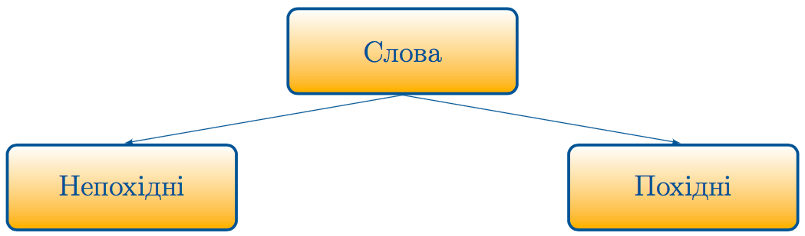

# Словотвір

Означення

<b>Словотвір</b> — роздiл науки про мову, що вивчає особливостi та способи творення похiдних слiв.

Означення

<b>Непохідні слова</b> — це слова, якi не утворенi вiд iнших слiв. Їхня основа складається лише з кореня.

Наприклад: <i>літо, сніг</i>.
 
 

Означення

<b>Похідні слова</b> — слова, утворенi вiд iнших слiв. Їхнiй спосiб творення можна простежити.

Наприклад: снiжний – снiг + н, пралiс – пра + лiс.