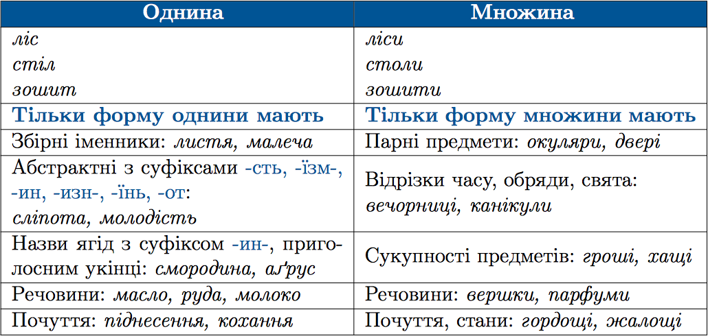

#Число іменників

 

<iframe align="center" width="560" height="315" src="https://www.youtube.com/embed/3TpxLMiL9IQ" frameborder="0" allowfullscreen></iframe>

 
<quiz correctLabel="correct" incorrectLabel="incorrect" checkLabel="check">
    <question text="">
       
Форми однини та множини мають усі іменники рядка:

        <answer>киянин, Львів, рука, озеро</answer>
        <answer correct>ліс, дорога, тарілка, кіт</answer>
        <answer>кріпацтво, тіло, берег, предмет</answer>
        <answer>вчитель, окуляри, вікно, ключ</answer>
        <explanation>
    Ліс – ліси, дорога – дороги, тарілка – тарілки, кіт – коти. 
Львів – власна назва, має форму тільки однини. 
Кріпацтво – абстрактне поняття, має форму тільки однини. 
Окуляри – парний предмет, має форму тільки множини.
        <explanation>
    </question>
</quiz>