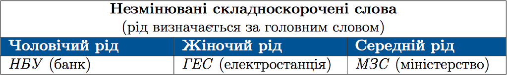

#Рiд складноскорочених слiв

 

Рiд змiнюваних складноскорочених слiв визначається за типом їхнього вiдмiнювання. Здебiльшого це iменники чоловiчого роду: <i>Мiнфiн, Виш</i>.

 
<quiz correctLabel="correct" incorrectLabel="incorrect" checkLabel="check">
    <question text="">
       
Іменник середнього роду наведено у рядку:

        <answer>ООН</answer>
        <answer>ТЕС</answer>
        <answer correct>МВС</answer>
        <answer>УПА</answer>
        <explanation>
    МВС – Міністерство внутрішніх справ. Головне слово – міністерство. Воно середнього роду. Отже, МВС також середнього роду.
        <explanation>
    </question>
</quiz>

 
<quiz correctLabel="correct" incorrectLabel="incorrect" checkLabel="check">
    <question text="">
       
Форми однини та множини мають усі іменники рядка:

        <answer>киянин, Львів, рука, озеро</answer>
        <answer correct>ліс, дорога, тарілка, кіт</answer>
        <answer>кріпацтво, тіло, берег, предмет</answer>
        <answer>вчитель, окуляри, вікно, ключ</answer>
        <explanation>
    Ліс – ліси, дорога – дороги, тарілка – тарілки, кіт – коти. 
Львів – власна назва, має форму тільки однини. 
Кріпацтво – абстрактне поняття, має форму тільки однини. 
Окуляри – парний предмет, має форму тільки множини.
        <explanation>
    </question>
</quiz>