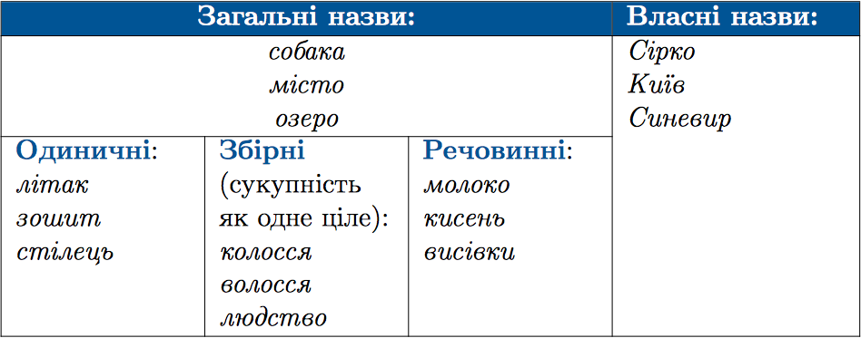
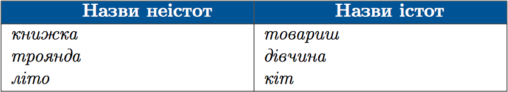
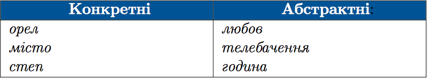

#Групи iменникiв за значенням

 

 

 
<quiz correctLabel="correct" incorrectLabel="incorrect" checkLabel="check">
    <question text="">
       
Усі іменники є назвами істот у рядку:

        <answer>актор, лялька, художник</answer>
        <answer correct>столяр, кухар, лікар</answer>
        <answer>мати, товариш, ліки</answer>
        <answer>робітник, фарба, митець</answer>
        <explanation>
     Лялька, ліки, фарба – назви неістот.
        <explanation>
    </question>
</quiz>

 
<quiz correctLabel="correct" incorrectLabel="incorrect" checkLabel="check">
    <question text="">
       
Усі іменники є конкретними у рядку:

      <answer correct> листя, стіл, іграшка, сумка</answer>
        <answer>книжка, радість, шафа, дерево</answer>
        <answer>школа, ліжко, глибина, вікно</answer>
        <answer>сум, криниця, ворота, молоко </answer>
        <explanation>
        Конкретні пізнаються органами чуття людини. Абстрактні: радість, глибина, сум.
        </explanation>
    </question>
</quiz>