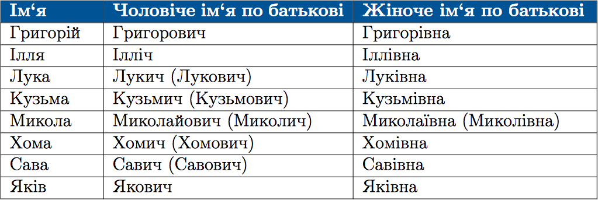

#Написання та вiдмiнювання iмен по батьковi

 

Паралельнi вiдмiнковi форми має iм'я Лев. Наприклад: <i>Льва i Лева, Львовi i Левовi</i>.
 

Окремi iмена утворюють форму по батьковi з iншими суфiксами:

 

<quiz> 
    <question>
       
 Помилку допущено в рядку:

           <answer> Григорій Савич</answer>
           <answer> Ганна Павлівна</answer>
           <answer> Віктор Миколайович</answer>
           <answer correct> Володимир Сергієвич</answer>
      <explanation>
Чоловічі імена по батькові утворюються за допомогою суфіксів -ович, -йович.
Володимир Сергійович. 
</explanation>
    </question>
</quiz>