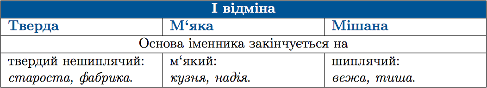
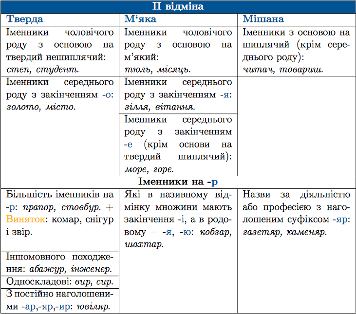

#Поділ іменників на групи

Iменники I i II вiдмiн подiляються на тверду, м‘яку та мiшану групи, залежно вiд їхнiх вiдмiнкових закiнчень.

 

 

 
<quiz correctLabel="correct" incorrectLabel="incorrect" checkLabel="check">
<question text="">
       
До твердої групи належать обидва іменники в рядку:

           <answer>староста, весілля</answer>
           <answer correct>батько, допомога</answer>
           <answer> робота, сторож</answer>
           <answer> Микола, тюль</answer>
<explanation>
<b>Батько</b> – II відміна, іменник чоловічого роду з основою на твердий нешиплячий приголосний.
<b>Допомога</b> – I відміна, іменник з основою на твердий нешиплячий приголосний. 
 
На належать до <b>твердої групи</b> іменники: <b>весілля</b> (II відміна, м’яка група), <b>сторож</b> (II відміна, мішана група), <b>тюль</b> (II відміна, м’яка група).       
</explanation>
    </question>

 
<quiz correctLabel="correct" incorrectLabel="incorrect" checkLabel="check">
<question text="">
       
До м’якої групи належать усі іменники в рядку:

           <answer>якір, знання, молодь, пісняр</answer>
           <answer>комар, вулиця, поле, ведмідь </answer>
           <answer>лицар, передмістя, каменяр, сонце</answer>
           <answer correct>олень, море, криниця, димар</answer>
           <answer> мрія, кінець, стаття, школяр</answer>
      <explanation>
<b>Олень</b> - II відміна, іменник з основою на м’який приголосний.  
<b>Море</b> - II відміна, іменник середнього роду з закінченням -е.  
<b>Криниця</b> – I відміна, іменник з основою на м’який приголосний.  
<b>Димар</b> - II відміна, іменник має в Н. в. мн. закінчення -і, а у Р. в. одн. закінчення -я, -ю. 
 
Не належать до <b>м’якої групи</b> іменники <b>пісняр</b> (мішана група), <b>комар</b> (тверда група), <b>каменяр</b> (мішана група), <b>школяр</b> (мішана група)       
</explanation>
</question>
</quiz>

