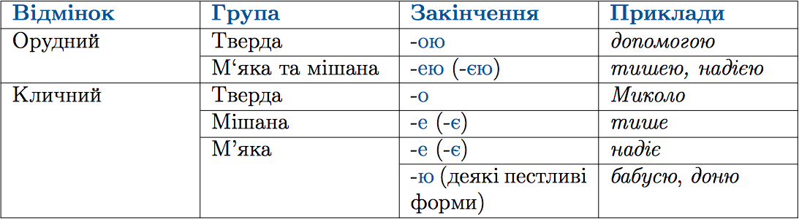

#Правопис окремих вiдмiнкових закiнчень iменникiв I вiдмiни в однинi

 

Деякi iменники в родовому вiдмiнку множини мають паралельнi форми. 
Наприклад: <i>легень - легенiв, губ - губiв, воєн - вiйн, сосен - сосон тощо.</i>