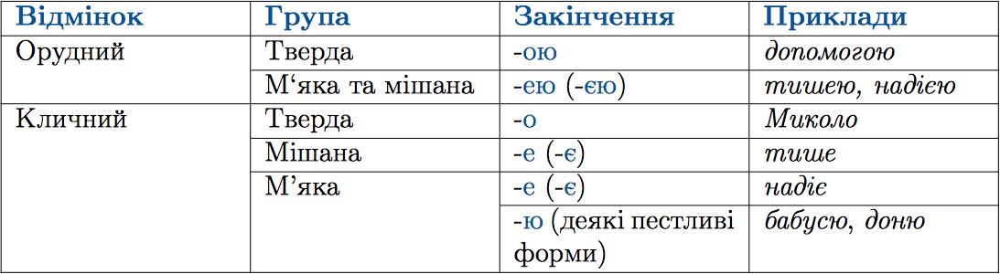

#Правопис окремих вiдмiнкових закiнчень iменникiв I вiдмiни в однинi

 

Деякi iменники в родовому вiдмiнку множини мають паралельнi форми. 
Наприклад: <i>легень - легенiв, губ - губiв, воєн - вiйн, сосен - сосон тощо.</i>

<quiz> 
    <question>
       
Закінчення -ою у формі орудного відмінка однини мають усі іменники в рядку:

           <answer>їдальня, розлука</answer>
           <answer correct> легенда, держава</answer>
           <answer> дитина, груша</answer>
           <answer> карта, геологія</answer>
      <explanation>
Легендою, державою - закінчення -ою у формі орудного відмінка однини мають іменники I відміни твердої групи.
Закінчення -ею мають іменники їдальня, геологія (м’яка група), груша (мішана група).
</explanation>
    </question>
</quiz>