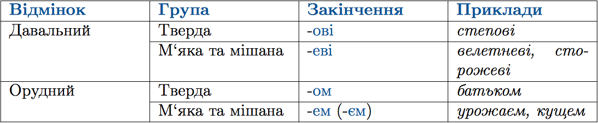
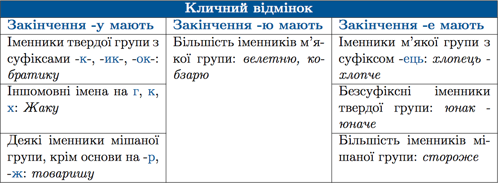

#Правопис окремих вiдмiнкових закiнчень iменникiв II вiдмiни в однинi

 

<iframe align="center" width="560" height="315" src="https://www.youtube.com/embed/8WSfTRmLZSw" frameborder="0" allowfullscreen></iframe>

 

<iframe align="center" width="560" height="315" src="https://www.youtube.com/embed/h0EN6yVW9Z4" frameborder="0" allowfullscreen></iframe>

<quiz> 
    <question>
       
Закінчення -ом у формі орудного відмінка однини мають усі іменники в рядку:

           <answer> велетень, президент</answer>
           <answer> папірус, пісняр</answer>
           <answer> стіл, чай</answer>
           <answer correct> звір, парашут</answer>
      <explanation>
Закінчення -ом у формі орудного відмінка однини мають іменники II відміни твердої групи. 
Звіром, парашутом – II відміна, тверда група. 
Чаєм, велетнем – II відміна, м’яка група. 
Піснярем - II відміна, мішана група.</explanation>
    </question>
</quiz>

<quiz> 
    <question>
       
Форму кличного відмінка утворено НЕправильно в рядку:

           <answer correct>хлопцю</answer>
           <answer>місяцю</answer>
           <answer>Фрідріху</answer>
           <answer>товаришу</answer>
      <explanation>
Іменники II відміни м’якої групи з суфіксом -ець мають закінчення -е у формі кличного відмінка (<i>хлопець - хлопче</i>).
 </explanation>
    </question>
</quiz>