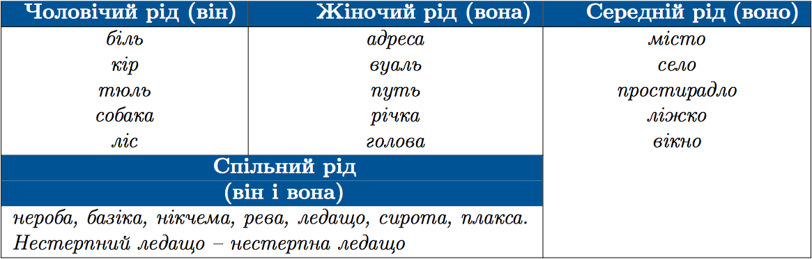

#Рiд iменникiв

 

До чоловiчого роду також належать назви осiб за видом дiяльностi i професiєю, що називають осiб чоловiчої та жiночої статi:

<i>Молод<b>ий</b> <u>водiй</u> куп<b>ив</b> автомобiль.</i> 
<i>Молод<b>ий</b> <u>водiй</u> купил<b>а</b> автомобiль.</i>
</ul>

<iframe align="center" width="560" height="315" src="https://www.youtube.com/embed/Ntjczd1XWeY" frameborder="0" allowfullscreen></iframe>

 
<quiz correctLabel="correct" incorrectLabel="incorrect" checkLabel="check">
    <question text="">
       
Спільний рід мають усі іменники в рядку: 

        <answer>Забіяка, сирота, бідолаха, лікар
</answer>
        <answer>Роззява, нероба, замазура, турист</answer>
        <answer correct>Лівша, рева, зануда, базіка </answer>
        <answer>Староста, незграба, вчитель, нікчема</answer>
        <explanation>
     Іменники спільного роду можуть називати осіб чоловічої і жіночої статі. 
Лікар, турист, вчитель – іменники чоловічого роду.
        <explanation>
    </question>
</quiz>