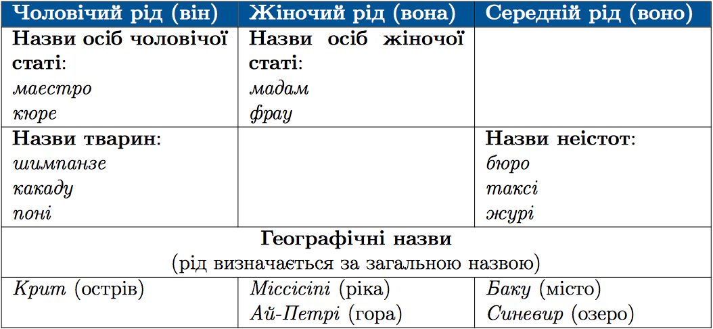

#Рiд незмiнюваних iменникiв iншомовного походження

Незмінюваними називають іменники, що <a href="http://ukr.ed-era.com/5/vidminki_imennikiv.html">не відмінюються.</a>

 

Зверніть увагу, рід незмінюваних іменників іншомовного походження, що позначають власні географічні назви, визначається за родовою ознакою (місто, озеро, гора тощо).  
