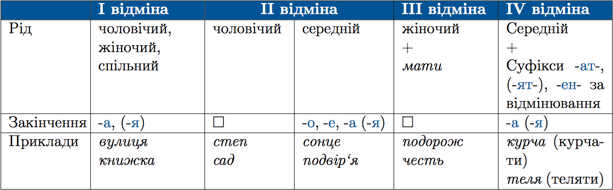

#Відміни іменників

 

НЕ належать до вiдмiн:

<ol>
<li>Множиннi iменники: <i>ворота, дверi, окуляри</i>.</li>
<li>Незмiнюванi iменники iншомовного походження: <i>кюре, амплуа</i>.</li>
<li>Iменники, якi походять вiд прикметникiв: <i>минуле, зерновi</i>.</li>
<li>Жiночi прiзвища на -о та приголосний: <i>Нечитайло Ольга</i>.</li>
</ol>