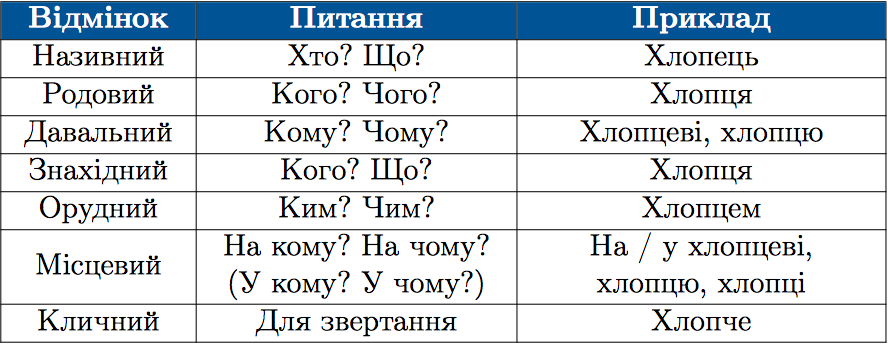

#Відмінки іменників

В українськiй мовi iменники вiдмiнюються за сiмома вiдмiнками. 

 

Називний вiдмiнок — прямий, усi iншi — непрямi.
 

Називний вiдмiнок однини є початковою формою iменника.

<b>НЕ</b> змiнюються за вiдмiнками:

<ol>
<li>Iншомовнi слова, що закiнчуються на голосний звук: кiно, меню, кашне. 
<b>Виняток:</b> пальто. </li>
<li>Жiночi прiзвища на -о та приголосний: Нечитайло, Чубач.</li>
<li>Iншомовнi прiзвища на -их, -ово, -аго, -е, -о, -i: Живаго, Черних.</li>
<li>Бiльшiсть буквенних абревiатур: НТР.</li>
<li>Деякi складноскороченi слова: замдекана, завскладу.</li>
</ol>

Пам'ятайте

Чоловiчi прiзвища на -о та приголосний вiдмiнюються.

 
<b>Кличний вiдмiнок</b>

<ol>
<li>Якщо звертання складається з iм‘я та iм‘я по батьковi, то обидваслова вживаємо у кличному вiдмiнку. 
Наприклад: <i>Олено Сергiївно</i>.</li>
<li>Якщо поєднанi двi загальнi назви, то форму кличного вiдмiнкамає перше слово, а форму кличного або називного – друге. 
Наприклад: пане лiкарю або пане лiкар.</li>
<li>Якщо звертання складається зi загальної назви та прiзвища, топрiзвище треба вживати у формi називного вiдмiнка. 
Наприклад: <i>пане Коваль</i>.</li>
</ol>

 
<quiz correctLabel="correct" incorrectLabel="incorrect" checkLabel="check">
    <question text="">
       
Білі стіни будинку вертають мені притомність. Виділений у реченні іменник ужитий у:

        <answer>називному відмінку</answer>
        <answer>знахідному відмінку</answer>
        <answer correct>родовому відмінку</answer>
        <answer>давальному відмінку</answer>
        <explanation>
  Білі стіни (кого? чого?) будинку вертають мені притомність.
        <explanation>
    </question>
</quiz>

 
<quiz correctLabel="correct" incorrectLabel="incorrect" checkLabel="check">
    <question text="">
       
Граматично правильне звертання в рядку:

        <answer>Шановний пане Микола!</answer>
        <answer>Високоповажний пане Бондаре!</answer>
        <answer correct>Вельмишановна Валеріє Сергіївно!</answer>
        <answer>Шановна пані Олена!</answer>
        <answer>Вельмишановний пан лікар!</answer>
        <explanation>
  Вельмишановна Валеріє Сергіївно! – Якщо звертання складається з ім’я та ім’я по батькові, то обидва слова вживаємо у кличному відмінку. 
Шановний пане Микола! – Шановний пане Миколо! (Якщо звертання складається з двох іменників, то обидва слова зазвичай мають форму кличного відмінка).  
Високоповажний пане Бондарю! – Високоповажний пане Бондар (Якщо звертання складається з прізвища та загальної назви, то прізвище треба вживати у формі називного відмінка).  
Шановна пані Олена! – Шановна пані Олено! (Якщо звертання складається з двох іменників, то обидва слова зазвичай мають форму кличного відмінка).  
Вельмишановний пан лікар! – Вельмишановний пане лікар (лікарю)! (Якщо поєднані дві загальні назви, то форму кличного відмінка має перше слово, а форму кличного або називного – друге).
        <explanation>
    </question>
</quiz>

