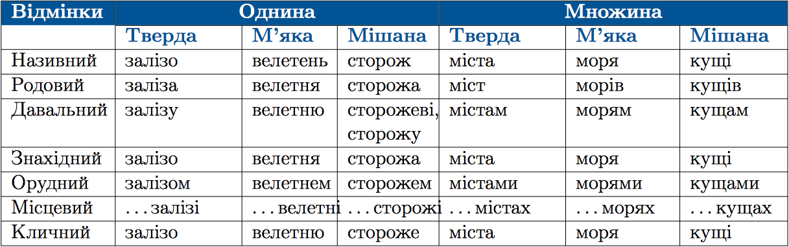

#Вiдмiнювання iменникiв II вiдмiни

 

 

<h4>Зміст підрозділу:</h4>

1. [Закiнчення родового вiдмiнка однини iменникiв чоловiчого роду II вiдмiни](5/zakinchennya_rodovogo_vidminka_odnini.md)
2. [Правопис окремих вiдмiнкових закiнчень iменникiв II вiдмiни в однинi](5/pravopis_okrremih_vidminkovih_znachen_II_vidmini_v_odnini.md)
3. [Правопис окремих вiдмiнкових закiнчень iменникiв II вiдмiни в множинi](5/pravopis_okrremih_vidminkovih_znachen_II_vidmini_v_mnojini.md)