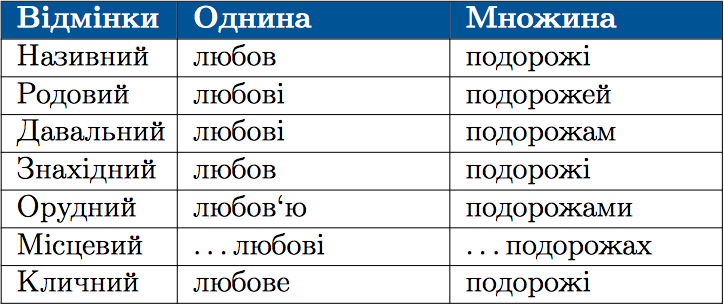

#Вiдмiнювання iменникiв III вiдмiни

 

Усi iменники <b>III вiдмiни</b> в орудному вiдмiнку однини мають закiнчення -у (-ю), а приголоснi основи подвоюються. 
Наприклад: <i>сiллю, подорожжю</i>.

 
НЕ відбувається подвоєння

<ol>
<li> Якщо основа закiнчується на б, п, в, м, ф, щ, р: любов'ю, матiр'ю.</li>
<li> Якщо приголоснi збiгаються перед -ю в кiнцi основи: радiстю,
вiстю.</li>
</ol>

<quiz> 
    <question>
       
 У формі орудного відмінка однини подвоєння НЕ відбувається в рядку:

           <answer>подорож</answer>
           <answer>суміш</answer>
           <answer correct>радість</answer>
           <answer>ніч</answer>
      <explanation>
Радістю – збіг приголосних у кінці основи перед -ю.
 </explanation>
    </question>
</quiz>