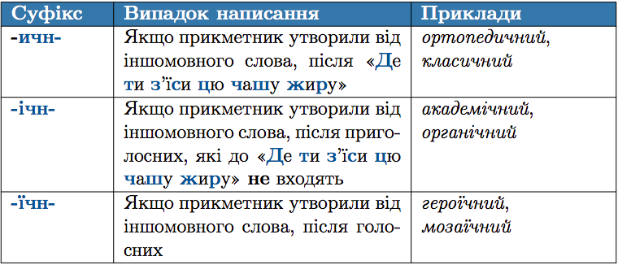

#Правопис суфiксiв -ичн, -iчн-, -їчн- у прикметниках

 

<quiz> 
    <question>
       
 За допомогою суфікса -ичн- утворюються прикметники від усіх іменників рядка:

           <answer correct>демократія, історія</answer>
           <answer>полуниця, герой</answer>
           <answer>географія, драма</answer>
           <answer>ідеологія, синтаксис</answer>
      <explanation>
Суфікс –ичн- пишемо у прикметниках, утворених від іншомовних слів після букв, які входять до «Де ти з'їси цю чашу жиру». Демократія - демократичний, історія – історичний. </explanation>
    </question>
</quiz> 
