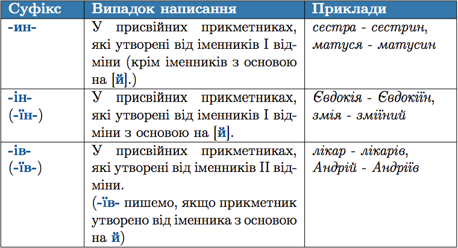

#Правопис суфiксiв -ин-, -iн-, -iв- у присвiйних прикметниках

 

<quiz> 
    <question>
       
 За допомогою суфікса -ин- утворюються присвійні прикметники від усіх іменників рядка:

           <answer>матуся, Андрій</answer>
           <answer>Наталя, змія</answer>
           <answer>Надія, староста</answer>
           <answer correct>сестра, Оксана</answer>
      <explanation>
Суфікс -ин- пишеться у присвійних прикметниках, утворених від іменників I відміни (крім іменників з основою на [й]). <i>Сестра – сестрин, Оксана – Оксанин</i>.  
Суфікс -ін- (-їн-) пишеться у присвійних прикметниках, утворених від іменників змія, Надія, тому що це іменники іменників I відміни з основою на [й]. <i>Змія – зміїний, Надія – Надіїн</i>.
Суфікс -ів- (-їв-) пишеться у присвійному прикметнику, утвореному від іменника Андрій, тому це іменник II відміни. <i>Андрій – Андріїв</i>. 
</explanation>
    </question>
</quiz> 
