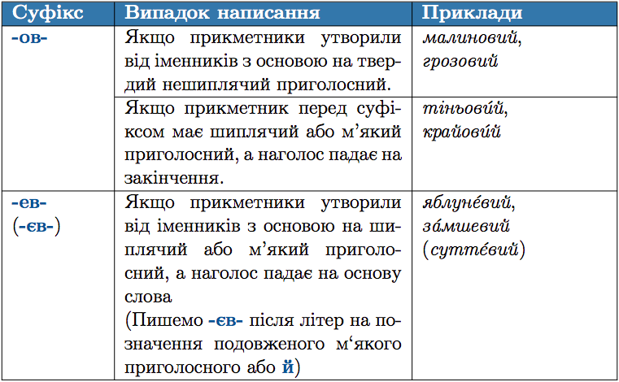

#Правопис суфiксiв -ов, -ев-, (-єв-) у прикметниках

 

<quiz> 
    <question>
       
Літеру е треба писати на місці пропуску в усіх словах рядка:

           <answer>матч..вий, оранж..вий, алюміні..вий</answer>
           <answer>січн..вий, дощ..вий, ситц..вий</answer>
           <answer correct>алич..вий, замш..вий, помаранч..вий</answer>
           <answer>кисн..вий, сторож..вий, грунт..вий</answer>
<answer>галуз..вий, овоч..вий, полин..вий</answer>
      <explanation>
Суфікс -ев- пишемо в прикметниках, утворених від іменників з основою на м’який приголосний і з наголосом на основі слова: аличевий, замшевий, помаранчевий. 
 
Суфікс -ов- пишемо в іменниках дощовий, ґрунтовий (наголос на закінченні), полиновий (прикметник, утворений від іменника з основою на твердий приголосний). 
 
Суфікс -єв- пишемо в прикметнику алюмінієвий (після й). </explanation>
    </question>
</quiz> 
