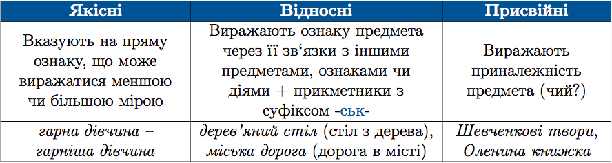
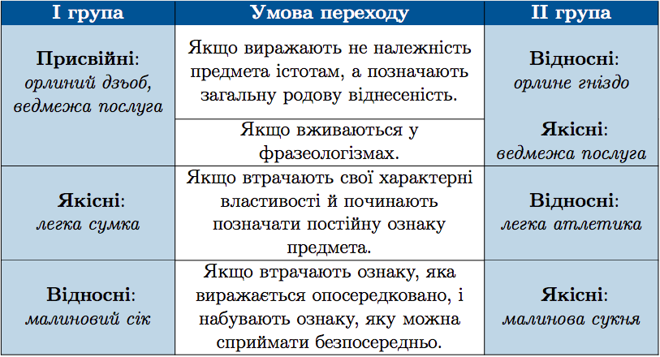

#Розряди прикметникiв за значенням

 

Прикметники можуть переходити з розряду у розряд. Це залежить вiд iменникiв, з якими вони узгоджуються.

 

<quiz> 
    <question>
       
До якісних належать обидва прикметники в рядку:

           <answer>малиновий сік, тиха ніч</answer>
           <answer correct>давня казка, вишнева сукня</answer>
           <answer>лебедина пісня, народна творчість</answer>
           <answer>міцний камінь, учнівський щоденник</answer>
      <explanation>
Якісні прикметники виражають ознаку предмета, що може виявлятися меншою чи більшою мірою.  
Не належать до якісних прикметники у словосполученнях: малиновий сік (відносний), народна творчість (відносний), учнівський щоденник (відносний).
    </explanation>
    </question>
</quiz> 

<quiz> 
    <question>
       
 До складу всіх словосполучень входять присвійні прикметники в рядку:

           <answer> Шевченкові вірші, мамина сумка, ясен місяць, Василева донька </answer>
           <answer> учнівський щоденник, учителів портфель, батькові речі, сусідчині інструменти </answer>
           <answer correct> Іванів син, парубкові штани, дідова онучка, заяча нора </answer>
           <answer> Оксанина сукня, дядькові вуса, Ігореві олівці, лисячий характер </answer>
      <explanation>
Іванів син, парубкові штани, дідова онучка, заяча нора – присвійні прикметники. Вони виражають приналежність предмета (чий?). 
Ясен місяць, лисячий характер – якісні прикметники. 
Учнівський щоденник – відносний прикметники. </explanation>
    </question>
</quiz> 
