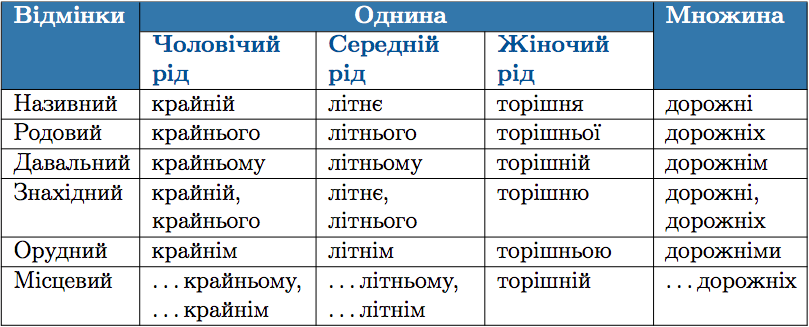

#Вiдмiнювання прикметникiв м'якої групи

 

<quiz> 
    <question>
       
Закінчення -ім у форму давального відмінка множини має прикметник:

           <answer>смачний</answer>
           <answer>тихий</answer>
           <answer>міцний</answer>
           <answer correct>дорожній</answer>
      <explanation>
Закінчення -ім у формі давального відмінка множини мають прикметники м’якої групи.  
Даю яким? Дорожнім.
</explanation>
    </question>
</quiz> 
