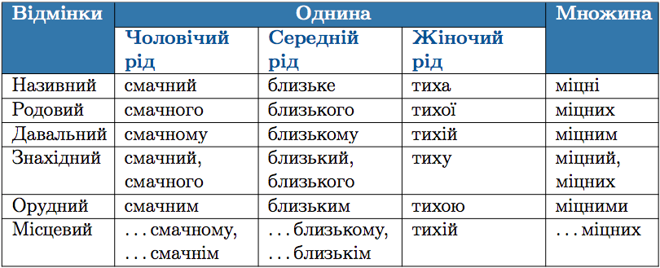

#Вiдмiнювання прикметникiв твердої групи

 

<quiz> 
    <question>
       
Закінчення -им у формі орудного відмінка однини має прикметник:

           <answer>крайній</answer>
           <answer correct>близький</answer>
           <answer>торішній</answer>
           <answer>літній</answer>
      <explanation>
Закінчення -им у формі орудного відмінка однини мають прикметники твердої групи.  
Орудую яким? Близьким.
</explanation>
    </question>
</quiz> 
